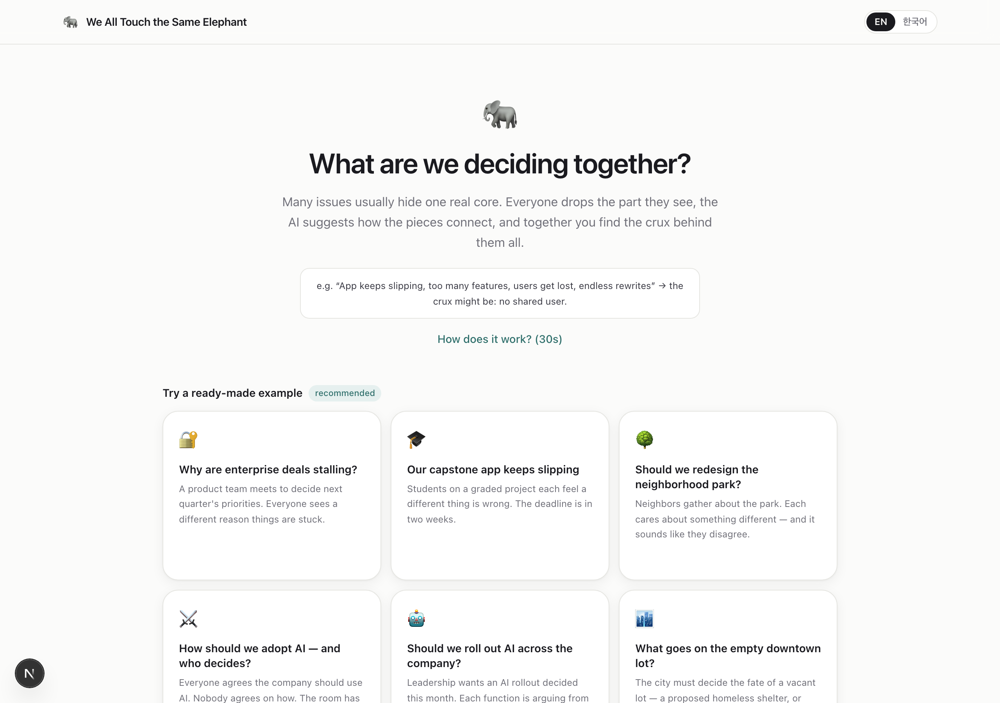
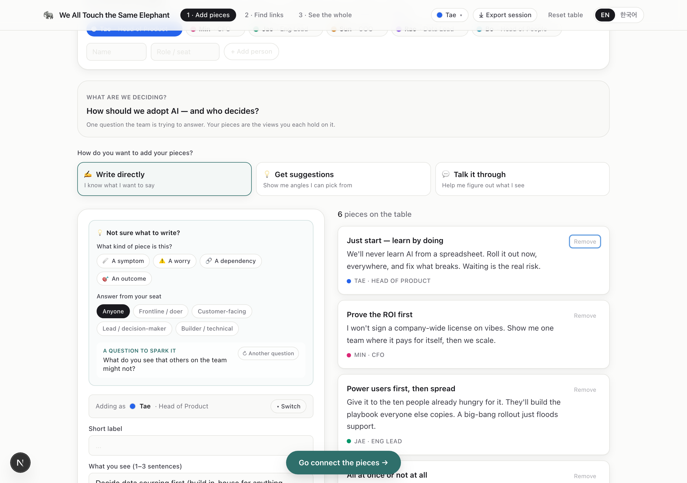
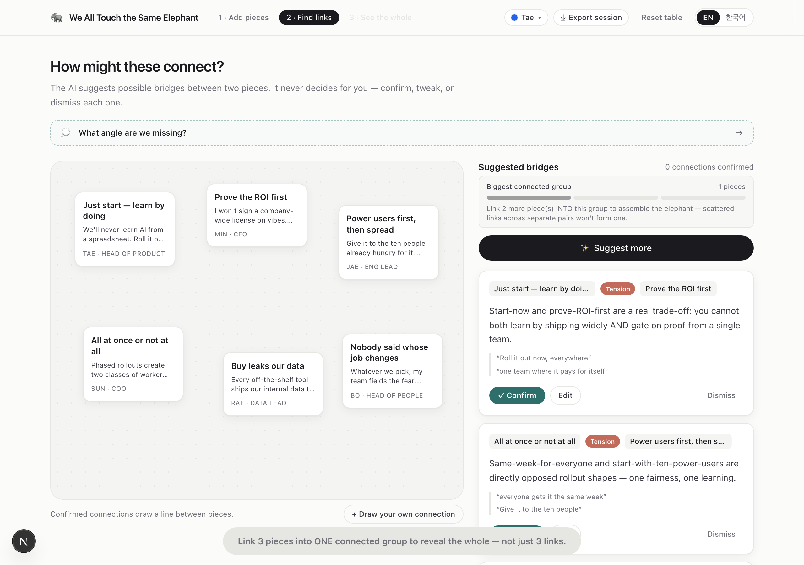
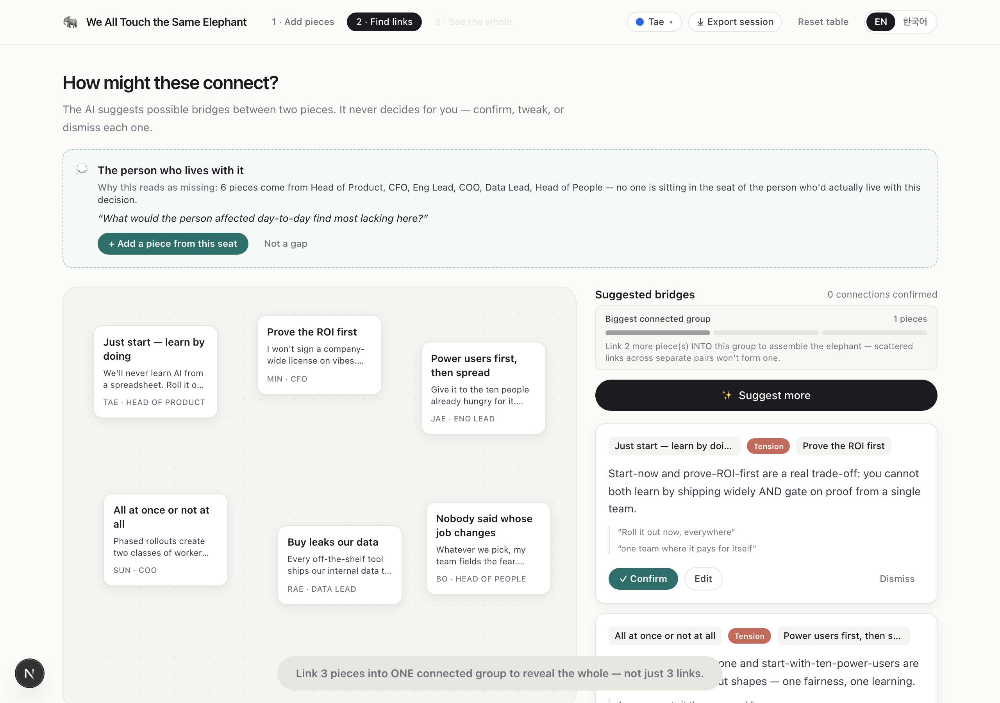
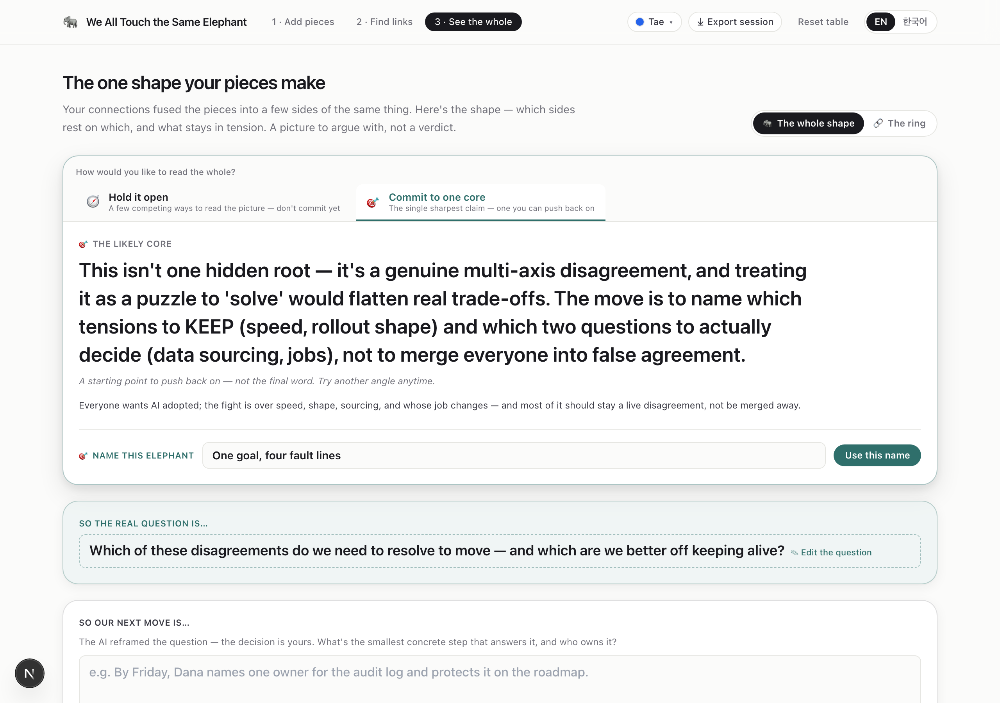
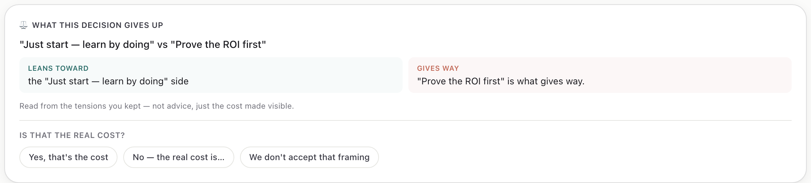

<div align="center">

# 🐘 We All Touch the Same Elephant

**Everyone sees a part. The AI proposes how the parts connect. The team assembles the whole.**

*An AI-mediated tool for teams that need to integrate genuinely different perspectives — without flattening them into a false consensus.*

[](https://nextjs.org/)
[](https://react.dev/)
[](https://www.typescriptlang.org/)
[](./LICENSE)
[](#)

</div>

---

<div align="center">

</div>

> Like the parable of the blind men and the elephant: each teammate holds a fragment of the whole, and everyone insists they're touching a different animal. This tool helps a group discover they were touching the **same elephant** all along — while keeping the disagreements that are *real* fully alive.

---

## The problem

Teams often fail to combine what they know — not because information is missing, but because each person's partial view *looks* unrelated, competing, or redundant to everyone else. Complementary perspectives get misread as conflicting ones, and the pieces never connect. In the research literature this is a **representational gap** (Cronin & Weingart, 2007).

Most AI tools respond by **summarizing** everyone into one smooth answer — which quietly erases the very differences that mattered, and produces an *artificial consensus* no one actually holds.

## The stance

**We All Touch the Same Elephant (WATSE) takes the opposite approach. One rule governs the whole design:**

> ### The AI never authors a perspective. It proposes *relationships between people's own words* and points at what's missing — nothing more.

Everything follows from that line:

| | |
|---|---|
| 🧩 **Fragments stay visible** | The AI never replaces anyone's words with a summary. |
| 🔗 **It proposes connections, not conclusions** | Its only move is to suggest a *typed bridge* between two human-written pieces. |
| ✋ **Humans assemble the whole** | The team confirms, edits, re-types, hand-draws, or rejects every bridge. |
| 🚫 **Keeping things apart is a first-class act** | A team can declare "these must **not** be merged" — refusing a merge is a claim, not silence. |
| 🪞 **The reading comes last, as a mirror** | Only after the team connects things does the AI reflect the shape back — never as an opening move that would anchor them. |

---

## How it works

A session moves through three steps. Try it with no setup — six hand-written scenarios run fully offline in a deterministic **sample mode** (no API key required).

### 1 · Gather — each person drops the part they see

Stuck on a blank card is the hardest moment, so the entry adapts to how sure you are: **write directly**, **pick an angle** the AI scatters, or **talk it through** — the AI asks a couple of open questions and turns *your own answer* into editable card drafts. It never writes the perspective for you.

<div align="center">

</div>

### 2 · Connect — the AI proposes bridges; the team decides what holds

Each bridge is **typed** — and the type is the point. `dependency` (one drives another), `tension` (a real trade-off), `overlap` (the same thing said twice), `complement` (two halves of one situation), or `separate` (**keep these apart**). Confirm, edit, re-type, or draw your own. A quiet prompt — *"What angle are we missing?"* — names a **seat no one has taken**, grounded in the roles actually on the table, and hands you a blank card from that seat to fill in yourself.

<div align="center">

</div>

<div align="center">

<br><em>The blind spot names the seat and asks a question — it never sits in it. The rationale cites the roles actually present ("6 pieces come from Head of Product, CFO, Eng Lead… no one is in the seat of the person who'd live with this decision").</em>
</div>

### 3 · See the whole — a shape to argue with, not a verdict

A synthesis engine reads structure over the confirmed graph — fusing genuinely-same pieces into *facets*, ordering them by what drives what, finding the causal root, and keeping real tensions as their own strand. The AI then reads that shape back in the mode you ask for: **hold it open** (a few competing readings) or **commit to one core** (the single sharpest claim). Then it hands the pen back: name the elephant, sharpen the real question, write *your own* decision.

<div align="center">

</div>

And once you've written the decision, the tool mirrors the **cost** it commits to — read straight off the tensions the team themselves kept — then lets the team **contest** it. That contest (accept it, relocate the cost, or reject the framing) is the negotiation the whole tool exists to support.

<div align="center">

</div>

---

## Why the synthesis is real (and not a loose prompt)

The reading isn't the AI free-associating over a list. Before the model is ever called, a **deterministic graph engine** computes the shape and injects it as fact:

- **Facets via union-find** — only `overlap` fuses two pieces into one side; `tension` and `separate` never do.
- **A causal DAG** from the directional relations — `dependency` and `complement` set the flow.
- **Root by causal position, not link count** — the piece that drives the rest but nothing drives *it* is the root, even when it's sparsely connected (which is exactly why teams miss it).
- **A `separate` edge is a boundary, not glue** — it's excluded from every graph walk (clustering, the assembly gate, reachability), so "keep apart" genuinely holds pieces apart.

The LLM receives this structure — facets, spine, root, live tensions, an assembled-ness score — and is instructed to *read it*, not invent one.

---

## Built for research

WATSE is a probe for studying **Integration Boundary Work**: how teams negotiate what to **merge** versus what to **keep separate** when an AI proposes integrations of their partial views. Every session is an append-only, timestamped event log that makes that negotiation measurable — and exportable as one JSON file for analysis.

The design records not just what teams were *shown* but what they *pushed back on* — because the pushback is the phenomenon:

- **Type-flips** — the AI proposes `overlap` ("same thing"), the team re-types it to `tension` ("no, a trade-off"). On Cronin & Weingart's taxonomy that is a *misread-as-redundant gap being corrected in real time* — logged with both the AI's original type and the human's final one.
- **Refusals** — rejected bridges, kept-redundant edges, and declared `separate` boundaries are all preserved, not discarded.
- **AI-framing kept vs overridden** — the AI's proposed name/question is stored beside the team's final version.
- **Contested costs** — when the team relocates or rejects the trade-off the AI names.
- **Blind-spot conversion** — a named seat *shown* vs actually *filled by a human* vs *dismissed as not-a-gap*.

The design line — the AI never authors perspective content — is what keeps the representational gap a thing to *observe* rather than an artifact the tool manufactures.

---

## Quickstart

```bash
git clone https://github.com/Soohwan-Lee/weAllTouchSameElephant.git
cd weAllTouchSameElephant
npm install
npm run dev          # → http://localhost:3000
```

Open the app and pick a ready-made scenario — it runs end-to-end with **no API key** (deterministic sample mode).

### Live AI mode

To have the model propose bridges and readings on your own content, add an OpenAI key:

```bash
cp .env.example .env.local
# .env.local
OPENAI_API_KEY=sk-...
OPENAI_MODEL=gpt-5.4-mini   # optional; this is the default
```

Without a key, every AI route falls back to a hand-written or graph-grounded response, so the full flow always works.

---

## Tech stack

| Layer | Choice |
|---|---|
| Framework | **Next.js 15** (App Router) · **React 19** · **TypeScript** (strict) |
| State | **Zustand** — a single session store, the source of truth for the event log |
| AI | **OpenAI** via API routes, with a deterministic sample-mode fallback on every route |
| Styling | **Tailwind CSS** — a calm, paper-toned, light/dark, fully responsive UI |
| i18n | Built-in **EN / KO**, switchable mid-session (and recorded when it happens) |

```
src/
├── app/api/          bridges · name · seeds · talk · blindspot · tradeoff  (+ sample fallbacks)
├── lib/
│   ├── synthesis.ts  the graph engine (facets · causal DAG · root · tensions)
│   ├── clusters.ts   connected-group detection; `separate` excluded from every walk
│   ├── store.ts      session state + the append-only boundary-work event log + export
│   ├── prompts.ts    every prompt — each one forbids authoring perspective content
│   └── scenarios.ts  six bilingual, hand-authored scenarios
└── components/       StartScreen · GatherScreen · ConnectScreen · MirrorScreen · …
```

---

## Roadmap

- [ ] Per-device sessions — each participant connects from their own screen (the participant model is already the seam)
- [ ] Fragment editing + post-assembly re-synthesis, with an AI "did I understand you right?" check-back
- [ ] An analysis notebook over the exported JSON (per-participant timelines, type-flip and contest rates)
- [ ] A pilot study with intact teams on a decision they actually own

---

## Background & citations

- **Cronin, M. A., & Weingart, L. R. (2007).** *Representational gaps, information processing, and conflict in functionally diverse teams.* Academy of Management Review, 32(3).
- **Kolko, J. (2010).** *Abductive thinking and sensemaking: The drivers of design synthesis.* Design Issues, 26(1).

---

<div align="center">

**MIT Licensed** · Built as a research prototype for studying Integration Boundary Work.

*If your team keeps arguing about the same elephant, this is for you.*

</div>
