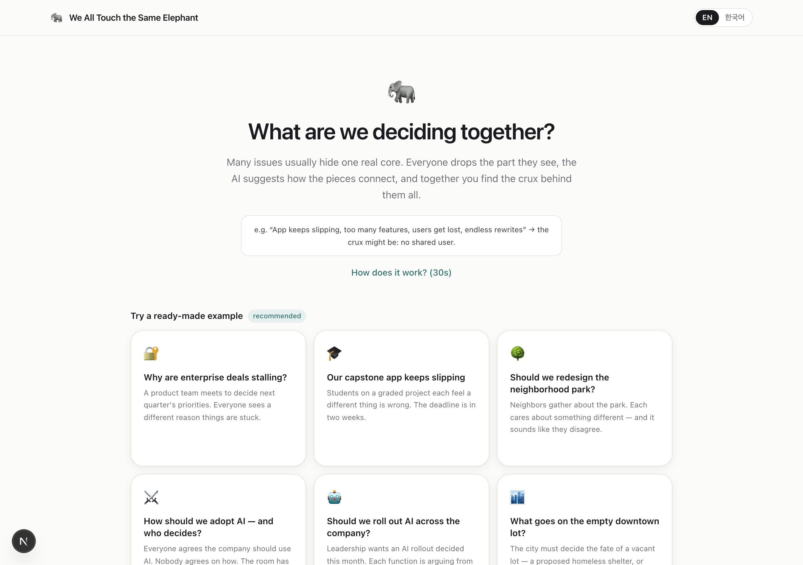
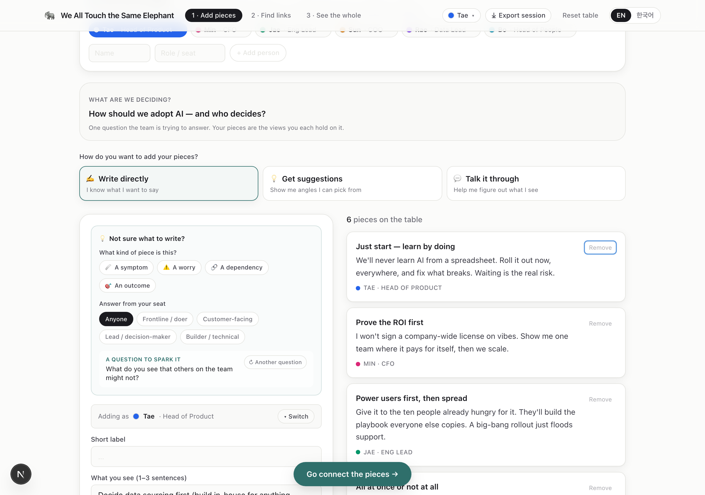
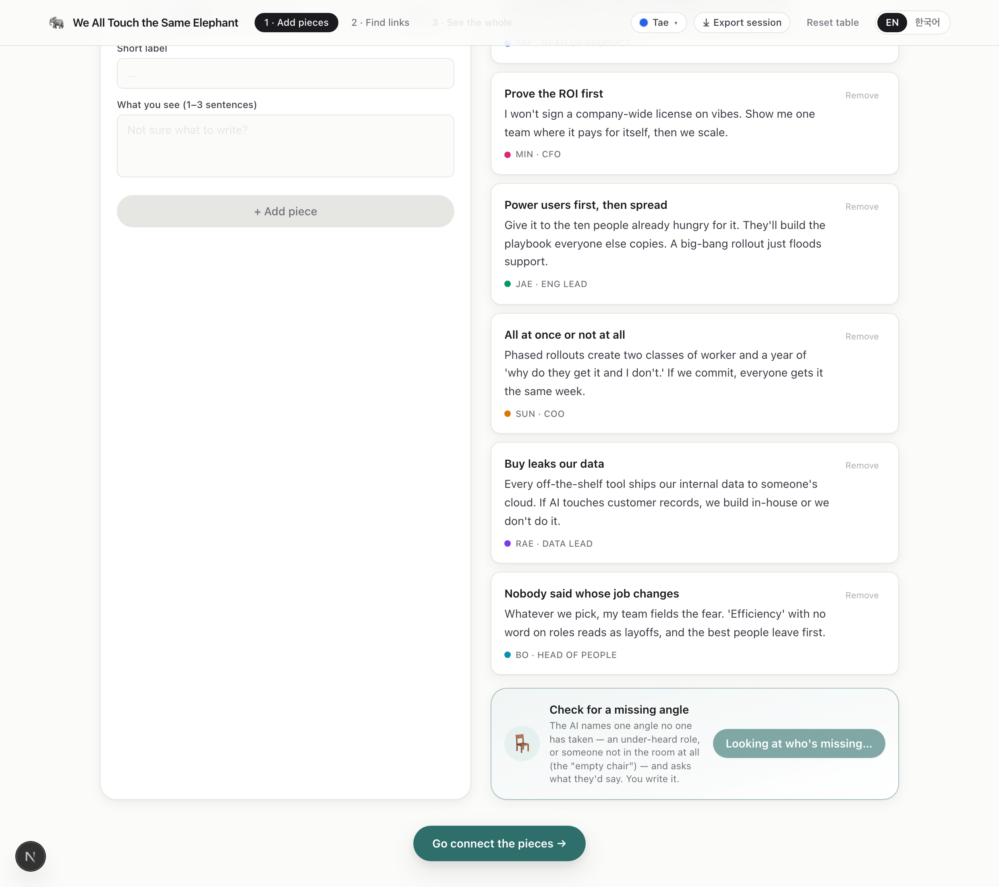
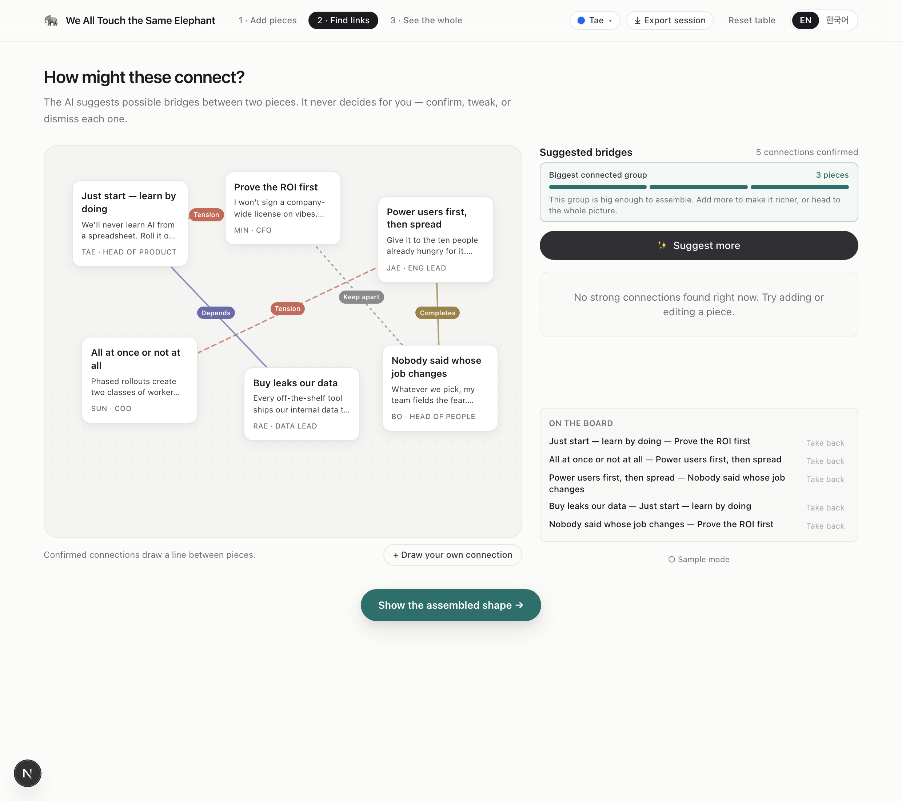
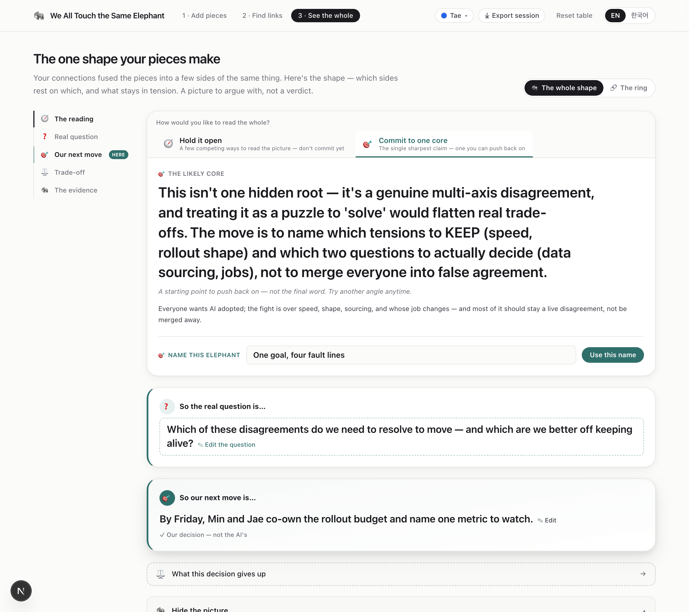
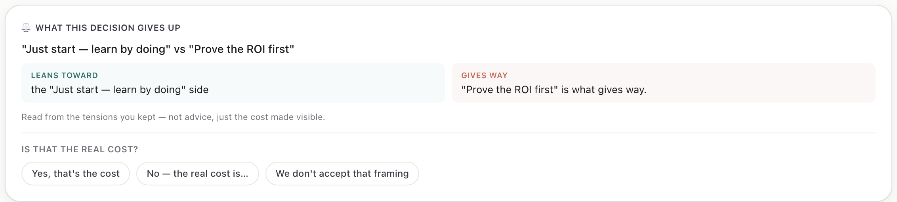

<div align="center">

# 🐘 We All Touch the Same Elephant

**Everyone sees a part. The AI proposes how the parts connect. The team assembles the whole.**

*An AI-mediated tool for teams that need to integrate genuinely different perspectives — without flattening them into a false consensus.*

[](https://nextjs.org/)
[](https://react.dev/)
[](https://www.typescriptlang.org/)
[](./LICENSE)
[](#)

</div>

---

<div align="center">

</div>

> Like the parable of the blind men and the elephant: each teammate holds a fragment of the whole, and everyone insists they're touching a different animal. This tool helps a group discover they were touching the **same elephant** all along — while keeping the disagreements that are *real* fully alive.

---

## The problem

Teams often fail to combine what they know — not because information is missing, but because each person's partial view *looks* unrelated, competing, or redundant to everyone else. Complementary perspectives get misread as conflicting ones, and the pieces never connect. In the research literature this is a **representational gap** (Cronin & Weingart, 2007).

Most AI tools respond by **summarizing** everyone into one smooth answer — which quietly erases the very differences that mattered, and produces an *artificial consensus* no one actually holds.

## The stance

**We All Touch the Same Elephant (WATSE) takes the opposite approach. One rule governs the whole design:**

> ### The AI never authors a perspective. It proposes *relationships between people's own words* and points at what's missing — nothing more.

Everything follows from that line:

| | |
|---|---|
| 🧩 **Fragments stay visible** | The AI never replaces anyone's words with a summary. |
| 🔗 **It proposes connections, not conclusions** | Its only move is to suggest a *typed bridge* between two human-written pieces. |
| ✋ **Humans assemble the whole** | The team confirms, edits, re-types, hand-draws, or rejects every bridge. |
| 🚫 **Keeping things apart is a first-class act** | A team can declare "these must **not** be merged" — refusing a merge is a claim, not silence. |
| 🪞 **The reading comes last, as a mirror** | Only after the team connects things does the AI reflect the shape back — never as an opening move that would anchor them. |

---

## How it works

A session moves through three steps. Try it with no setup — six hand-written scenarios run fully offline in a deterministic **sample mode** (no API key required).

### 1 · Gather — each person drops the part they see

Stuck on a blank card is the hardest moment, so the entry adapts to how sure you are: **write directly**, **pick an angle** the AI scatters, or **talk it through** — the AI asks a couple of open questions and turns *your own answer* into editable card drafts. It never writes the perspective for you.

**Collect before explaining.** On a multi-person table, a first-round panel shows whose
seat has not contributed yet and opens a concrete-observation card for that person. The
starter set separates **something I observed** from **an assumption to question**, so a
direct signal and the explanation placed on it do not arrive as one unquestioned fact.
This is a nudge, never a gate.

**Your seat aims the questions.** Saying what you're responsible for — "Sales — I own new-account onboarding" — picks the lens you're asked from, so two people are prompted differently and their cards diverge by seat instead of converging on the same generic complaint. Worth being precise about why: a live A/B of *no role* vs *one word* vs *a full sentence of context* measured **identically** on every output metric (3.0 of 5 seats, 4/4 cross-seat claims, 4/4 root, 12/12 grounded — `test/rolecontext.live.mts`). Richer role text does **not** improve the AI's reading. It earns its place by helping the *person* write a card only they could write, and that is the only claim made for it.

<div align="center">

</div>

Once a couple of pieces are down, a quiet check sits under the table: *"What angle are we missing?"* It names a **seat no one has taken** — an under-heard role, or someone **not in the room at all** (the *empty chair*) — grounded in who's actually present, and hands you a blank card from that seat to fill in yourself. It names the seat and asks a question; it never sits in it.

<div align="center">

<br><em>The blind spot lives where adding a piece already lives — right under the pieces so far — so filling it is just the next add, not a trip back a screen. The rationale cites the roles actually present, and the empty chair is named, never spoken for.</em>
</div>

### 2 · Connect — the AI proposes bridges; the team decides what holds

Each bridge is **typed** — and the type is the point. `dependency` (one drives another), `tension` (a real trade-off), `overlap` (the same thing said twice), `complement` (two halves of one situation), or `separate` (**keep these apart**). Confirm, edit, re-type, or draw your own. The gate to the next step isn't a bridge count — it's **one connected group of ≥ 3 pieces**, so three links across separate pairs won't fake an assembly.

The **discovery compass** exposes the next process question rather than scoring the team:
is a seat still absent, have two different seats actually met, has anyone claimed a causal
direction, and has the emerging picture survived a tension or boundary? An AI bridge also
takes two deliberate steps to accept: the team reviews the reading first, and only then can
it become part of the confirmed graph.

**The review asks about *this* link, not links in general.** That checklist used to be three
fixed sentences printed under every card, which a team reading eight proposals stops reading
around the third — the failure mode the step exists to prevent. The questions are now selected
per bridge in deterministic code (`src/lib/reviewChecks.ts`) from facts the session already
holds, and each relation type gets the question aimed at how *that* type goes wrong:

| Signal | What changes |
|---|---|
| **Relation type** | `overlap` is the only relation that *fuses* two people's cards into one facet, so it asks whether they are really saying the same thing or only sharing words. `dependency` asks about direction and **names both cards** — the abstract version is what made the old line skippable. `tension` asks whether the trade-off is real, which is what the trade-off panel downstream depends on. |
| **Evidence** | Asking *"do the quoted parts support this?"* when nothing is quoted is a question about something not on the screen. A link with no evidence says so plainly: only the AI's sentence holds it together. |
| **Whose cards it crosses** | Cross-seat is where the contestable claim lives; same-seat is where a team mistakes one person's internal consistency for the table agreeing. |

The **confounder** question — *could both be effects of a third thing nobody has tabled?* — is
reserved for `dependency` and `overlap`, the two types where a hidden common cause is a live
alternative reading. It is the only check that points at a **gap** rather than validating a link
the AI already drew, which is the job the design line reserves for the AI.

No model authors any of this: every string is a fixed human-authored template, and the only
interpolated text is the team's own card titles and seat names. Selection is deterministic — two
independent id-derived bits, so the order does not reshuffle under a team mid-argument, and a
card with an endpoint missing falls back to abstract phrasing rather than quoting a title that
isn't there.

<div align="center">

</div>

### 3 · See the whole — a shape to argue with, not a verdict

A synthesis engine reads structure over the confirmed graph — fusing genuinely-same pieces into *facets*, ordering them by what drives what, finding the causal root, and keeping real tensions as their own strand. Before the AI speaks, the team records its own current hypothesis and the evidence that would make it wrong; skipping is allowed but visible in the research log. The AI then reads that shape back in the mode you ask for: **hold it open** (competing readings), **point at a hypothesis** (one falsifiable bet), or **commit to one core** (the single sharpest claim). Then it hands the pen back: name the elephant, sharpen the real question, write *your own* decision.

The final screen is one continuous argument — **reading → real question → your next move → its trade-off** — with a sticky rail down the side so the spine stays legible and the *decision* stays the centre of gravity. Each block says **who is speaking**: `◇ AI proposes` for a suggestion you may reject, `✍ your words` for the team's own. (The question's tag is computed against the AI's draft, not against emptiness — the draft is seeded into the field, so calling an untouched one "your words" would put words in the team's mouth.) The assembled map, story and stats sit below as inspectable **evidence**.

And the reading says **whose pieces it was read off** — resolved from the verified citations, so a fabricated one can never put a person's name there:

> Read from **Tae** · 5 other piece(s) not drawn on

That second clause is the useful half. A synthesis leaning on one of six voices reads exactly like one integrating all six, and a team had no way to tell them apart. Driving a live session against the real model produced precisely that line: the verdict named a root and rested on a single piece. Previously an invisible failure; now a contestable one — *"that's just Tae's point"* is an argument the interface makes available.

<div align="center">

</div>

And once you've written the decision, the tool mirrors the **cost** it commits to — read straight off the tensions the team themselves kept — then lets the team **contest** it. That contest (accept it, relocate the cost, or reject the framing) is the negotiation the whole tool exists to support.

That cost is only worth contesting if it is recognisably *this* team's. The step used to see two
3-word titles per tension and nothing else — worst of all for a tension the team **drew
themselves**, which carries no AI-extracted evidence quotes at all, so the model saw two
headlines and one line of explanation. Sending the pieces changed the output measurably (8 runs
per arm, `gpt-5.4-mini`): the model went from citing a kept tension in **0/8** runs to **4/8**.
Without them it named costs that would fit any team — *"existing accounts get less specialist
attention."* This is a single small A/B on one fixture, not a study; it was run to decide whether
the change was worth making at all, since three earlier prompt-only changes here measured null.

Offline, the deterministic fallback names the cost by word-overlap, and two of its outputs were
wrong in ways only probing found. One shared generic word was enough to claim a lean, so a
decision to *"improve the onboarding flow"* matched a tension about *"improve the audit trail"* on
the word **improve** alone. And a tie was broken toward whichever side came first, so *"document
the process"* against *"process takes too long" ⟷ "documentation is missing"* reported the team
favouring the opposite of what they wrote. Generic words can no longer carry a match on their
own, and a tie now falls through to the honest opportunity cost. That last rule has a cost of its
own — a decision naming **both** sides ("X before Y", "품질보다 속도를 택한다") ties and drops,
1 of 6 such decisions still firing — which is accepted because an inverted lean tells the team
something untrue about their own decision while a false negative only withholds a reading. It is
written down at the call site and pinned in `test/tradeoff.test.mts` rather than left to be
rediscovered.

<div align="center">

</div>

---

## Why the synthesis is real (and not a loose prompt)

The reading isn't the AI free-associating over a list. Before the model is ever called, a **deterministic graph engine** computes the shape and injects it as fact:

- **Facets via union-find** — only `overlap` fuses two pieces into one side; `tension` and `separate` never do.
- **A causal DAG** from explicit `dependency` relations. `complement` still connects two
  pieces, but does not make either one the cause of the other.
- **Root by causal position, not link count** — the piece that drives the rest but nothing drives *it* is the root, even when it's sparsely connected (which is exactly why teams miss it).
- **A `separate` edge is a boundary, not glue** — it's excluded from every graph walk (clustering, the assembly gate, reachability), so "keep apart" genuinely holds pieces apart.

The LLM receives the original session question plus this structure — facets, spine, root, live tensions, an assembled-ness score — and is instructed to *read it*, not invent one. The question is supplied only as scope; cards and confirmed links remain the evidence.

### The reading is checked against the team's own table

"Read it, don't invent one" used to be a request the prompt made and nothing verified. Now it's enforced mechanically:

- **Every piece and link gets a citable handle** — `[F1]`, `[B2]` — minted per request and listed in the prompt. They are the only references the model is allowed to use.
- **The model must cite what each claim rests on** (`"grounds":["F2","B1"]`), for the name, each reading, and the question.
- **The server verifies every citation handle** against the real table. A handle that points at nothing is dropped; a claim left with no surviving citation is recorded as unsupported. Hallucinated references cannot reach the screen because code removes them, not because a prompt asked nicely.
- **Verified citations resolve back to real fragment/bridge ids** and land in the session log, so an analysis can ask which pieces the AI's framing actually leaned on — and which parts of the table it ignored.

This makes *"the AI pointed at real parts of the team's structure"* a **measured property of each response** (a citation-validity rate and a fabrication rate) instead of a design promise. It does **not** prove semantic entailment: a valid `[F2]` can still be a weak or mistaken justification for the sentence beside it. Grounding never rewrites the model's prose or blocks a response — it only removes invalid citations and reports what survived, so a bad model day degrades to today's behavior rather than a blank screen.

> **What a live ablation actually showed** — and what it didn't. Running the real model across four conditions that differ only in how much of the team's work the prompt carries (`test/ablation2.live.mts`), the **bare** prompt named the causal root as reliably as the full one: 5/5 in both, while the payload nearly doubled. Typed relations *with direction* turn out to carry most of that signal on their own — a point in favour of the relation model, but **not** evidence that more context yields a better reading.
>
> What the added context does buy is measurable and different: the grounded conditions cite the team's own pieces at a **100% rate with 0% fabrication**, and cite *selectively* — the model names only the pieces it actually used. The bare condition cannot cite at all, having been given nothing to cite. So the honest claim is not "our pipeline produces better insight" but **"our pipeline makes the insight traceable to the team's own pieces."**

### Every AI step sees the work, not a summary of it

> ⚠️ **Current version / tentative.** The pipeline below is the state as of this revision and is still being evaluated — treat it as the working design, not a settled contribution.

The rule the whole pipeline is now audited against: **if a team authored it, the step that reasons about it must see it.** Each AI call had been quietly reduced to a thin slice of what the team actually built, so work done on one screen went unrepresented on the next.

| Step | Saw before | Sees now |
|---|---|---|
| **Connect** — propose links | the pieces, nothing else. A "find more" round was byte-identical to the first, so it could re-offer a pair just rejected | the original session question as scope; what's confirmed, what was **dismissed**, and where the team **corrected its relation types** — plus a server-side filter, so settled pairs can't come back regardless of what the model does. Which proposals **reach the tray** is now a selection rule, not the model's ordering (below) |
| **Blind spot** — name a missing seat | isolated cards. Asked to spot "one side of a trade-off only" while shown no trade-offs | the links, the kept tensions, and which pieces are still loose |
| **Reveal** — read the shape | a typed graph of titles | the original session question as scope; fragment bodies, author seats, each link's **explanation and evidence**, hand-drawn links, and every AI-override |
| **Directions** — starting moves | a crux title and title-pairs | the pieces in their own words, the causal spine, and why each tension is one |
| **Trade-off** — the cost | title matching. It was the endpoint this audit missed: the pieces were computed for the reveal one screen above and dropped before this call | the pieces in the team's own words, plus a citable handle per kept tension, resolved back to the real link |

And the reverse discipline, because more context is not free — [Context Rot](https://www.trychroma.com/research/context-rot) (Chroma, 2025) and [Anthropic's context-engineering guidance](https://www.anthropic.com/engineering/effective-context-engineering-for-ai-agents) both find that irrelevant context costs *accuracy*, not just tokens, and that same-domain distractors are the worst kind. A re-rendered fragment title is exactly that. So each prompt carries what only the engine knows and drops what the links already say: the reveal no longer re-lists kept tensions as bare title-pairs when the links block shows them with the team's own explanation. A card title now appears 2–4× per prompt instead of 4–5× — run `npm test` and read the
DUPLICATION block at the end, which prints the current count per title rather than asking you to
trust this sentence.

### Does the team's work survive the model, or only reach it?

The table above is the *input* side — what each step sees. The question that actually matters is whether the five things a team reads at the end still rest on the pieces **they** wrote. Measured by running the real prompts through the model and verifying every citation server-side against the real handle table (`test/outputs.live.mts`, gpt-4.1, 3 runs):

| | |
|---|---|
| Claims grounded in the team's own pieces | **89%** (24/27) |
| Citations pointing at nothing | **0** |
| Verdict names the engine's causal root | **3/3** |
| **Verdict states the cross-seat claim no single card contains** | **3/3** |
| Trade-off tied to a real kept tension | 3/3 |
| Next move rests on the team's spine | 3/3 |

Once one such bug turned up, the pattern was worth hunting rather than waiting for. **Four hand-offs were dropping the team's work silently**, all with the same signature — a narrowing that looked like a reasonable default, with nothing reporting the loss:

| What was lost | How it looked to the team |
|---|---|
| Every causal branch but the longest | 5 connected seats, a spine naming 3 |
| **The entire second group** — `clusters[0]` is all anything reads | 3 people fully assembled into their own elephant, invisible, at **"100%"** |
| `separate` boundaries crossing the cluster edge | The one link that says *"do not merge these"* — dropped, so the reading could merge them |
| `supports` / `dependsOn` / `isKeystone` in the event log | The model saw the shape; the research payload couldn't reconstruct it |

The second group is not fixed by feeding both to the model — two unconnected groups are genuinely two pictures, and merging them would invent a link nobody drew. So the reading now **says what it is not about**, names the other group's pieces, and offers the way back. Shown, never enforced.

Building that trace found a real bug that reading the code had not: the **spine kept only the longest path from each root** and silently discarded every other branch. A root with three consequences — three different people — handed the model one of them, at 100% wholeness, with nothing reporting the loss. Every branch now survives, reduced by greedy set-cover so a dense table stays small (12 pieces: 1,024 chains and 75KB → one chain, 125 chars).

**What it did not fix:** the verdict still rests on **3.0 of 5 seats**. The model now sees all five and cites three, so that is citation behaviour rather than missing data — an open question, not a solved one.

### The links have to cross people, and asking for that did nothing

A connection between two of *your own* notes is you restating yourself. A connection between **your piece and someone else's** is the table assembling — and it's where the finding lives that neither of you could state alone, because each only saw their side of it. The reveal can only read across links the team actually drew, so if the links stay inside one person, the final reading is one voice wearing the group's name.

This was a real failure, found by execution rather than by reading the code: the gate to the reveal asks for a connected group of **three pieces**, and three pieces can all belong to one person. A table of six pieces from four people, every link inside one person's three, **passes the gate with one voice holding the whole shape** — and nothing said so.

The obvious fix — tell the model to prefer links that cross people — **was measured and did nothing:**

| | cross-seat links | seats reached | quietest seat reached |
|---|---|---|---|
| Baseline | 64% | 2.8 / 4 | **0 of 5 runs** |
| *Prompt asks for it* | *58%* | *2.4 / 4* | *1 of 5* |
| **Server-side selection** | **100%** | **4.0 / 4** | **5 of 5** |

<sub>gpt-4.1, 5 runs per condition, identical table (`test/seatbridge.live.mts`, `test/seatselect.live.mts`).</sub>

That null is a local replication of [HiddenBench](https://arxiv.org/abs/2505.11556) (Li, Naito & Shirado, ICML 2026), which found multi-agent LLMs score **30.1%** under distributed information vs **80.7%** for a single agent given everything — because "agents cannot recognize or act under latent information asymmetry." Crucially those failures **"persist across prompting strategies,"** while the intervention that worked was *structural* (0.037 → 0.800). The failing test is kept in the repo for that reason: it's the argument for why this isn't a prompt.

So the rule lives where compliance isn't optional. The route asks the model for more links than it will show, then selects: take the proposal that brings in a person linked to **nobody**, then any cross-person link, then the rest — the model's own order breaking ties. It only ever picks among links the model genuinely proposed and never reorders on quality, so it **cannot manufacture a connection**, and the team still confirms or rejects every one.

The objective is **max-min**, which two independent literatures arrive at separately: [Alsobay et al.](https://arxiv.org/abs/2508.08242) (CSCW 2026, N=1,475) found LLM facilitation worked by *"raising the minimum level of engagement,"* and the [collective-dialogues](https://arxiv.org/abs/2503.01769) bridging rule ranks by the **lowest** agreement across groups. Coverage rather than airtime follows [Lu, Yuan & McLeod's meta-analysis](https://journals.sagepub.com/doi/10.1177/1088868311417243) (2012; 65 studies, 3,189 groups): whether a unique item surfaces **at all** predicts decision quality more strongly than how much discussion it gets.

Connect now also shows **how many people are in the shape**, and names those whose pieces link to no one — while it can still be fixed, rather than at the end when it can't. Shown, never enforced: the gate stays on pieces, because a team may have good reason to leave a piece out, and blocking would make the tool a supervisor instead of a mirror.

**Claims come after their citations.** [Tam et al. (EMNLP 2024)](https://arxiv.org/abs/2408.02442) found structured output degrades reasoning; later work located the cause in *ordering* — a schema that emits the verdict before its support lets the model pick a label and then hunt for justification. So bridge proposals emit evidence and explanation **before** the relation type, and the reveal emits each claim's citations **before** the claim. It's the same discipline the tool asks of the team.

**"Assembled" means related, not merged.** The wholeness score counted only `overlap` fusion, so a table wired end-to-end by `dependency` and `tension` read **0%** — a team that had built a complete causal chain was told they had assembled nothing. It is now the share of pieces carrying any connecting relation, with `separate` excluded so declaring boundaries can't inflate it.

### The prompt sees where the team overruled the AI

The most information-dense thing in a session was being written to the event log and never read again. When a team takes a link the AI called `overlap` — *"these are the same thing"* — and re-types it to `tension` — *"no, these genuinely pull against each other"* — they are making an explicit boundary-work claim: **they refused a merge.** That override, whether a link was hand-drawn, whether the explanation was rewritten in the team's own words, and the explanation text itself now all travel into the reveal prompt:

```
[B2] F2 <--tension--> F1 : "The faster we scale, the more the floor's trust erodes"
      ↳ THE TEAM OVERRODE THE AI: it proposed "overlap", the team re-typed it to "tension".
[B3] F2 -/-separate-/- F3 : "Fatigue and compliance are different kinds of claim"
      ↳ KEEP APART: the team declared these two must NOT be merged.
      ↳ THE TEAM DREW THIS THEMSELVES — the AI never proposed it.
```

No amount of re-reading the final graph would recover this: it is the record of a boundary being *contested and settled*. It is also, concretely, an input **no general-purpose assistant can be given** — pasting the same fragments into a chat window cannot reproduce a history the tool itself created.

---

## Why a group tool can't just be an individual one

> ⚠️ **Current version / tentative** — the design argument below is implemented and inspectable, but no pilot has run. Treat it as a position, not a finding.

Mature tools already do *sensemaking over many perspectives* — Sensecape, Graphologue, Selenite, NotebookLM. Nearly all of them assume **one user reading many sources**. Almost none assume **many users who are themselves the sources**, and that inversion breaks the assumptions rather than stretching them:

An individual tool treats perspectives as **external artifacts** the user is sovereign over — free to cluster, abstract, discard and re-summarize, answering to no one. When a group works on *its own* perspectives, the material was authored by people in the room. **Summarizing becomes a political act, discarding a social one, and the AI's structure has to be contestable by the person whose words were structured.**

Four things follow, each one implemented here:

| | What changes in a group |
|---|---|
| **`separate` is a relation** | An individual never needs to formally refuse a merge. A team does — and here "keep these apart" is a graph operation with a real cost: pieces joined only by `separate` never form a group, so the gate to the reveal stays shut. Declaring a boundary is a claim, not silence. |
| **Suggestions are selected for coverage of *people*** | An individual tool ranks suggestions by relevance to one reader; the only published diversity-aware rule in this space ([Relatedly](https://arxiv.org/abs/2302.06754), CHI 2023) is marginal relevance against *that reader's* history. With a group, the quantity worth covering is **whose views are in the picture at all**. The closest precedent, [CLIP](https://vis.cs.ucdavis.edu/vis2014papers/TVCG/papers/1633_20tvcg12-Mahyar-2346573.pdf) (Mahyar & Tory, TVCG 2014), does link collaborators automatically — but on **exact entity matches** ("we both mentioned George Prado"), which cannot express *your constraint causes their delay*. |
| **Citations resolve to people** | Personal tools cite back to documents. Here the source is a colleague, so the reading names seats — and names how many it *didn't* use. Treat this as a legibility aid, not a fix: two large experiments ([Alsobay et al.](https://arxiv.org/abs/2508.08242), N=1,475; [Parisi & Thain](https://arxiv.org/abs/2605.14097), FAccT 2026, N=879) found participation displays raise engagement **without improving decisions**, the latter naming the risk *"illusion of inclusion."* That's why the mechanism is the selection rule upstream, not this label. |
| **Refusals are kept** | Rejected bridges are preserved with their full payload rather than deleted, because a group's "no" is data about the group. |
| **Synthesis is deferred** | Reading is gated behind assembly. Sensecape lets a user re-abstract at will; for a group, an early AI reading is an anchor ([anchoring is the strongest determinant of deliberative outcome](https://link.springer.com/article/10.1007/s10670-024-00814-7)). |

**What is *not* solved:** shared attention. A single shared screen sidesteps the problem that two people at different zoom levels are not looking at the same thing — it doesn't answer it. That returns the moment sessions go per-device, which is exactly why that sits on the roadmap rather than in the build.

---

## Built for research

WATSE is a probe for studying **Integration Boundary Work**: how teams negotiate what to **merge** versus what to **keep separate** when an AI proposes integrations of their partial views. Every session is an append-only, timestamped event log that makes that negotiation measurable — and exportable as one JSON file for analysis.

The design records not just what teams were *shown* but what they *pushed back on* — because the pushback is the phenomenon:

- **Type-flips** — the AI proposes `overlap` ("same thing"), the team re-types it to `tension` ("no, a trade-off"). On Cronin & Weingart's taxonomy that is a *misread-as-redundant gap being corrected in real time* — logged with both the AI's original type and the human's final one.
- **Refusals** — rejected bridges, kept-redundant edges, and declared `separate` boundaries are all preserved, not discarded.
- **AI-framing kept vs overridden** — the AI's proposed name/question is stored beside the team's final version.
- **Contested costs** — when the team relocates or rejects the trade-off the AI names.
- **Blind-spot conversion** — a named seat *shown* vs actually *filled by a human* vs *dismissed as not-a-gap*.
- **Seat coverage** — how many people the assembled shape actually reaches, and who links to no one. The measure separates two things a piece count conflates: a team that assembled *a lot* and a team that assembled *across itself*. Because it's shown but never enforced, whether a team acts on an unlinked name is itself the boundary-work signal — is leaving someone out an oversight they fix, or a distinction they defend?
- **Grounding of the AI's framing** — which of the team's own pieces and links each reading actually cited (verified, as ids), what share of its claims were anchored at all, and what share of its citations pointed at nothing. Pairs with the accept-vs-override signal above to ask a sharper question than either alone: *did teams keep the framings that were read off their structure, and override the ones that weren't?*

The design line — the AI never authors perspective content — is what keeps the representational gap a thing to *observe* rather than an artifact the tool manufactures.

---

## Quickstart

```bash
git clone https://github.com/Soohwan-Lee/weAllTouchSameElephant.git
cd weAllTouchSameElephant
npm install
npm run dev          # → http://localhost:3000
```

Open the app and pick a ready-made scenario — it runs end-to-end with **no API key** (deterministic sample mode).

A session **survives a reload**. It is held in `localStorage`, so a closed tab or a refreshed
page returns to the table with its pieces, links and full event log intact, and the start screen
offers the way back rather than silently resuming. This matters more here than in most tools: the
event log *is* the research payload, so losing a session to a stray refresh would lose the data
the study is for. Storage is skipped on the server so the first client render matches.

### Live AI mode

To have the model propose bridges and readings on your own content, add an OpenAI key:

```bash
cp .env.example .env.local
# .env.local
OPENAI_API_KEY=sk-...
OPENAI_MODEL=gpt-5.4-mini   # optional; this is the default
```

Without a key, routes use deterministic sample/graph fallbacks. The bundled scenarios keep their hand-authored connection proposals and reveals; on a custom session, connection suggestions are empty and the team must draw links manually before continuing.

---

## Tech stack

| Layer | Choice |
|---|---|
| Framework | **Next.js 15** (App Router) · **React 19** · **TypeScript** (strict) |
| State | **Zustand** — a single session store, the source of truth for the event log |
| AI | **OpenAI** via API routes, with a deterministic sample-mode fallback on every route |
| Styling | **Tailwind CSS** — a calm, paper-toned, light/dark, fully responsive UI |
| i18n | Built-in **EN / KO**, switchable mid-session (and recorded when it happens) |

```
src/
├── app/api/          bridges · name · seeds · talk · blindspot · tradeoff · directions
│                     (every route has a deterministic sample fallback)
├── lib/
│   ├── synthesis.ts  the graph engine (facets · causal DAG · root · tensions)
│   ├── clusters.ts   connected-group detection; `separate` excluded from every walk
│   ├── grounding.ts  citable handles + server-side verification of what the AI cited
│   ├── evidence.ts   every quote checked to be a real span of the card it cites
│   ├── reviewChecks.ts  which review questions this bridge gets, and why
│   ├── tradeoff.ts   the deterministic cost matcher (a route may not export it)
│   ├── store.ts      session state + the append-only boundary-work event log + export
│   ├── prompts.ts    every prompt — each one forbids authoring perspective content
│   └── scenarios.ts  six bilingual, hand-authored scenarios
└── components/       StartScreen · GatherScreen · ConnectScreen · MirrorScreen · …

test/                    16 suites; a few worth naming
├── grounding.test.mts   handle minting, citation verification, override rendering
├── synthesis.test.mts   wholeness, keystone-by-causal-position, `separate` as a boundary
├── reviewchecks.test.mts  asserts the RENDERED question in both languages, not just its
│                        variables — a placeholder once reached the screen past vars-only tests
├── tradeoff.test.mts    incl. the tie rule's known false negative, pinned deliberately
└── pipeline.trace.mts   end-to-end: does a card's text actually reach each prompt?
```

```bash
npm test                          # unit tests
npm run build                     # also a real check — see below
npx tsx test/pipeline.trace.mts   # trace one session through every prompt
```

`npm run build` earns its place in that list. A route file may only export the HTTP handlers and
Next's config fields, so exporting a helper from one — to let a test import it — type-checks
cleanly and passes the entire suite while failing the production build. Deterministic logic
therefore lives in `src/lib` and the routes import it.

The trace is the answer to *"does the team's work actually reach the AI, or does it just look like it does?"* — it puts a distinctive token in every card and link, runs a real session through the real modules, and checks those tokens survive into each prompt. It also prints each prompt's size and how often a card title repeats, which is how the duplication above was found.

---

## Roadmap

- [ ] Per-device sessions — each participant connects from their own screen (the participant model is already the seam)
- [x] Fragment editing — a piece can be rewritten after it is down, logged with its before/after so a correction is visible in the research record rather than overwriting history
- [ ] Post-assembly re-synthesis, with an AI "did I understand you right?" check-back
- [ ] An analysis notebook over the exported JSON (per-participant timelines, type-flip and contest rates)
- [ ] A pilot study with intact teams on a decision they actually own

---

## Background & citations

- **Cronin, M. A., & Weingart, L. R. (2007).** *Representational gaps, information processing, and conflict in functionally diverse teams.* Academy of Management Review, 32(3).
- **Kolko, J. (2010).** *Abductive thinking and sensemaking: The drivers of design synthesis.* Design Issues, 26(1).

---

<div align="center">

**MIT Licensed** · Built as a research prototype for studying Integration Boundary Work.

*If your team keeps arguing about the same elephant, this is for you.*

</div>
